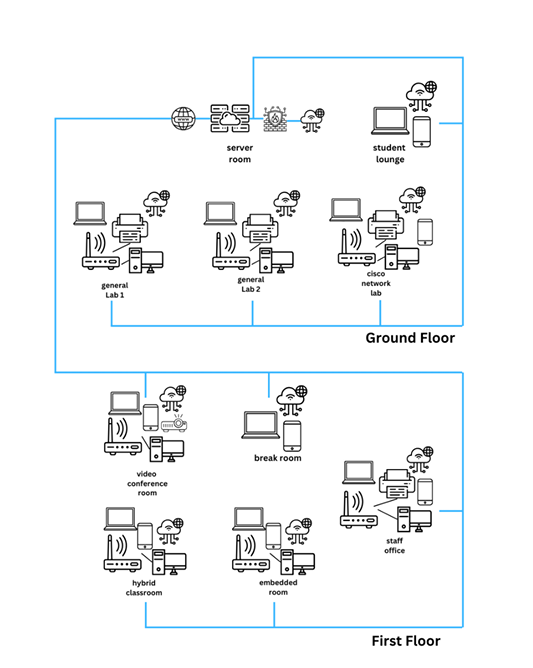
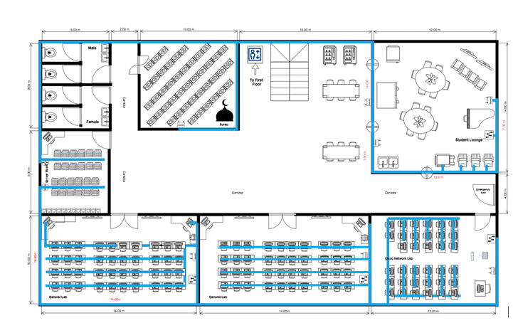

# Final Project: Network Infrastructure Design for Faculty of Computing (Block N28B)

## 1. Project Summary
As the major capstone assignment for this course, our team engineered a complete, production-grade enterprise network infrastructure blueprint for the Faculty of Computing’s new **Block N28B** building at UTM. The core engineering objective was to transform a blank architectural space into a high-performance, secure, and scalable digital environment. Our design supports diverse functional areas, including advanced computer labs, video conferencing suites, an open student lounge, and administration rooms. The project required detailed planning across every layer: calculating custom IP addressing schemes, organizing structured cabling runs, choosing enterprise-grade switches and routers, setting up security boundaries, and compiling a comprehensive financial cost analysis report.

---

## 2. Evidence and Explanation

*Figure 1: Network Distributed Diagram for Block N28B*

*Figure 2: Network Architecure Diagram for Block N28B First Floor*

* **Structural Area Assessment:** Evaluated the physical building blueprint to plan cable paths and node placements across multiple specialized environments, ensuring consistent network access throughout the facility.
* **Hierarchical IP Subnetting Scheme:** Designed an organized IP subnetting structure using precise network masks to partition administrative staff, high-traffic student lounges, and intensive learning labs into logical broadcast domains.
* **Enterprise Hardware Selection:** Selected specific enterprise-grade networking equipment (including high-throughput switches and edge routers), matching performance specifications against the faculty's operational needs and future expansion plans as illustrated in **Figure 1**.
* **Comprehensive Cost & Feasibility Assessment:** Compiled a complete procurement list detailing unit pricing, cable management expenses, installation fees, and long-term hardware lifecycles to prove the project's financial feasibility.
* **Collaborative Engineering Workflow:** Organized structured coordination sessions using collaborative documentation tools to align subnet layouts, hardware choices, and final report graphics across the entire team.

---

## 3. Reflection

### What I Learned
* This capstone project completely changed how I look at network engineering. It pushed me beyond basic simulator exercises and challenged me to balance strict technical performance with real-world building layouts, hardware limitations, and budget constraints.
* Designing the network infrastructure for Block N28B taught me that a great network must be secure and adaptable from day one. Organizing user groups into isolated subnets showed me how proper planning protects sensitive administrative data while allowing the network to grow smoothly over time.
* Working alongside my team to deliver this complex enterprise plan emphasized the value of collaborative engineering. Combining our skills to solve technical problems, double-check subnet calculations, and manage a realistic budget proved that high-quality system designs rely on solid teamwork and clear communication.

### Areas for Improvement
* While our hardware configuration successfully established high-speed connectivity across all floors, our baseline design relied heavily on manual adjustments. I want to focus on learning automated deployment tools like Cisco DNA Center to push policy updates across enterprise equipment more efficiently.
* Our current network diagram focused primarily on standard wired and wireless distribution paths. To better prepare for modern enterprise deployments, I plan to research integrating dedicated cloud-managed edge boundaries and SD-WAN architectures to improve remote troubleshooting capabilities.

---

### 👥 Team Credits (Group Assignment — Power Rangers)
* **Brendan Chia Yan Fei** (A23CS0211)
* **Chew Chiu Xian** (A23CS0061)
* **Elijah She Yu Sheng** (A23CS0073)
* **Lau Yan Kai** (A23CS0098)
