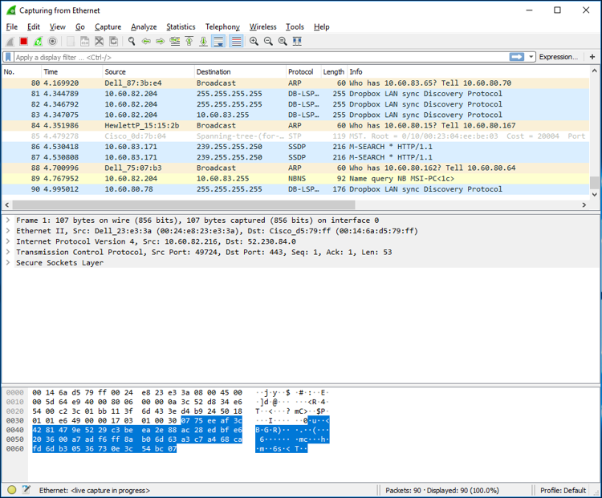

# Lab 1: Packet Analysis at Application Layer Using Wireshark 

## 1. Lab Summary
This practical lab focused on network communication behavior at the topmost layer of the OSI model: the **Application Layer**. Utilizing **Wireshark**, a high-performance packet analysis tool, I captured and scrutinized the exact sequence of packets exchanged between a client machine and remote servers. The objective was to unpack the operational mechanics of core protocols that drive daily web activities—specifically **HTTP (Hypertext Transfer Protocol)** and **DNS (Domain Name System)**. By inspecting raw protocol fields, message types, and port numbers, I established a clear understanding of client-server request-response loops and local DNS resolution behaviors.

---

## 2. Evidence and Explanation
### Wireshark DNS Protocol Packet Analysis

*Figure 1: Wireshark Domain Name System (DNS) Packet Capture Analysis*

* **Socket Mapping and Port Tracking:** Based on the captured packet protocol data units (PDUs) visible in the Wireshark trace, the client's outbound DNS query and the server's returning response are bound to **UDP Port 53**. The User Datagram Protocol (UDP) is explicitly utilized here to ensure minimal round-trip latency during address translation.
* **Target IP Routing Configuration:** The packet trace confirms that the DNS lookup was dispatched to the external public destination IP address **128.238.29.22**. A systematic check against local network properties confirms that this points to an authoritative look-up server rather than an internal local gateway DNS resolver.
* **Outbound Query Flag Signature:** Granular inspection of the query message's flag structure shows it is classified as a **Type A** standard host record request (mapping a domain name to an IPv4 target). At the point of origin, the outbound query contains **0 answers** since it represents an unfulfilled request waiting for a server handshake.
* **Payload Dissection & TTL Caching:** The server response packet delivers exactly **1 answer** block containing:
    * The queried domain string.
    * The standard internet class mapping classification (`0x0001` hexadecimal value).
    * The resolved target IPv4 address starting with `18.x.x.x`.
    * A 4-byte data length parameter.
    * A **Time to Live (TTL) of 60 seconds (1 minute)**. This parameter indicates how long the client machine or local proxy is authorized to cache this specific domain mapping before it expires and triggers a fresh over-the-network lookup.

---

## 3. Reflection

### What I Learned
* This lab completely shifted my understanding of **web surfing**. Seeing an everyday action like loading a webpage broken down into explicit, human-readable ASCII headers helped me appreciate the deep structural logic that governs the internet.
* **Investigating DNS packet payloads** showed me that web interactions do not exist in a vacuum. I realized how seamlessly a background UDP handshake handles domain mapping before an explicit TCP session can even begin.
* Learning to filter out data noise inside Wireshark gave me a valuable debugging skillset. Mastering field diagnostics and protocol tracking transforms network issues from confusing puzzles into structured engineering steps.

### Areas for Improvement
* During initial capture sequences, background operating system telemetry and local network noise flooded my workspace. I need to improve my command of **pre-capture expression filters (BPF)** rather than relying solely on post-capture display filters to streamline analysis.
* While Wireshark cleanly formats protocol fields into user-friendly text fields, I want to practice matching raw hex bytes in the packet bytes pane directly to their structural binary equivalents to handle custom or non-standard protocol formats down the road.
