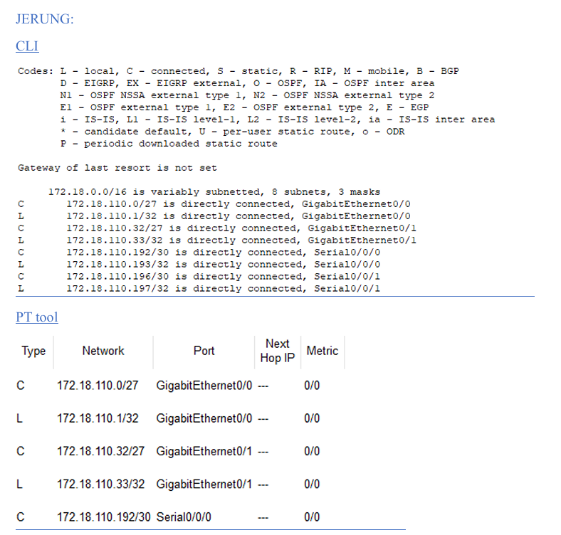

# Lab 3: Hierarchical IP Subnetting and RIP Routing Configuration 

## 1. Lab Summary
This advanced routing lab combined structural mathematical network planning with hands-on command-line device configurations. Given a baseline network block of **172.18.110.0/23**, I calculated a custom **Variable Length Subnet Masking (VLSM)** scheme to divide IP space among multiple isolated regional LAN divisions (JERUNG, SHARK, and TIBURON subnets) matching exact host volume metrics. Following subnetting, I built the multi-router topology in Cisco Packet Tracer, accessing the Cisco IOS command-line interface (CLI) to provision interface gateways and configure **RIP (Routing Information Protocol)** to establish dynamic, end-to-end network connectivity.

---

## 2. Evidence and Explanation

*Figure 1: Router Local Interfaces and Learned RIP Routes Audit*

* **VLSM Subnet Calculation:** Mathematically subdivided the /23 network boundary down to distinct blocks (such as `/27`, `/26`, and point-to-point `/30` serial links) to fulfill specific host demands (ranging from 20 up to 60 usable nodes) while completely eliminating unused IP addresses.
* **Cisco IOS Gateway Provisioning:** Configured device interfaces through the Cisco IOS CLI, setting up hardware gateway addresses, clock rates, and subnetwork masks across multiple edge routers.
* **Dynamic RIP Routing Deployment:** Initialized dynamic routing daemons by running network propagation commands (`network 172.18.0.0` and `network 192.168.1.0`) to configure routers to dynamically swap updates.
* **Routing Table Validation:** Used diagnostic commands (`show ip route`) to verify the structure of RIP-learned routes across devices. As confirmed in **Figure 1**, routing tables successfully populated dynamically learned (R) paths for distant subnets.
* **Connectivity Testing:** Updated routing criteria on endpoints and executed full cross-network ICMP ping sweeps from end terminals to verify perfect end-to-end client connectivity across all subnets.

---

## 3. Reflection

### What I Learned
* Calculating VLSM tables taught me that network stability depends entirely on structured planning. Learning how to organize overlapping IP spaces to fit exact host needs without wasting addresses showed me how professional networks are built.
* Configuring dynamic routing daemons changed how I look at wide-area networks. Seeing isolated routers run automated lookup checks to dynamically exchange missing subnets helped clarify how data finds the fastest path across multiple networks.
* Working directly inside the Cisco IOS CLI to troubleshoot missing routes built my technical problem-solving skills. Learning to use validation commands to check routing tables taught me how to diagnose configuration issues systematically.

### Areas for Improvement
* Managing network advertisements for large network address blocks can become complex. I want to practice implementing manual route summarization rather than relying on default classful auto-summarization properties inside the routing engine.
* While RIP successfully established basic connectivity, its slow convergence and reliance on hop counts make it less suitable for larger architectures. I plan to explore configuring classless link-state protocols like OSPF to better support larger corporate network footprints.
