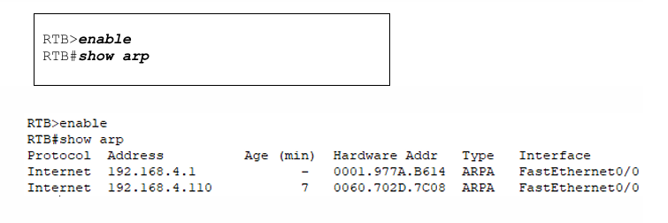

# Lab 4: ARP Exploration and Wireless LAN Integration 

## 1. Lab Summary
This lab investigated intermediate network lookup behaviors and modern edge access integrations. The first component explored the **Address Resolution Protocol (ARP)** and local MAC address learning mechanics inside local area networks. By executing simulated data transmissions across multi-switch topologies, I analyzed how hardware frames map onto logical IP targets. The second phase integrated enterprise wireless communication pathways, configuring standalone local home gateways alongside professional **WPA2-Personal** encryption settings to safely bridge wireless end-user nodes onto established wired corporate VLAN boundaries.

---

## 2. Evidence and Explanation

*Figure 1: Local ARP Mapping and High-Fidelity Wireless Connection Metric Status*

* **ARP Table Diagnostic Inspection:** Accessed Cisco router and switch terminal command-line interfaces (`show arp` and MAC address tables) as shown in **Figure 1** to trace how physical hardware addresses bind onto logical IP addresses.
* **Dynamic MAC-to-Port Map Building:** Observed how layer-2 switches automatically build internal lookup maps by reading incoming source hardware frame components to optimize local routing and reduce broadcast traffic.
* **Enterprise Wireless LAN Setup:** Provisioned wireless local access controllers, manually establishing custom SSIDs (`WRS LAN`), setting up DHCP auto-address allocation pools, and deploying **WPA2-Personal** encryption.
* **End-to-End Wireless Connectivity Validation:** Connected wireless client computers using passphrases, verified structural signal and link quality metrics, and passed full ICMP ping connectivity sweeps out across the wired VLAN backbone.

---

## 3. Reflection

### What I Learned
* Exploring the ARP cache showed me how the logical world of software IP addresses connects to physical network cards. Watching switches learn and map MAC addresses to specific ports clarified how local networks route data efficiently.
* Setting up enterprise wireless access and deploying WPA2 encryption helped me understand modern corporate security. I learned that bridging wireless clients onto a wired network backbone requires careful attention to security settings and authentication.
* Tracking down configuration errors across a mix of wired switches, wireless access points, and client machines built my confidence in handling complex setups. It proved that troubleshooting a network requires a structured approach across different layers of the system.

### Areas for Improvement
* During heavy local broadcasts, tracking raw ARP streams inside a crowded terminal can be difficult. I need to focus on implementing smart VLAN isolation techniques to keep broadcast domains compact and responsive.
* While WPA2-Personal provided strong basic encryption for our simulation, large corporate offices require individual login credentials. I plan to study how to integrate external AAA/RADIUS authentication servers to manage more secure, user-specific wireless access profiles.
